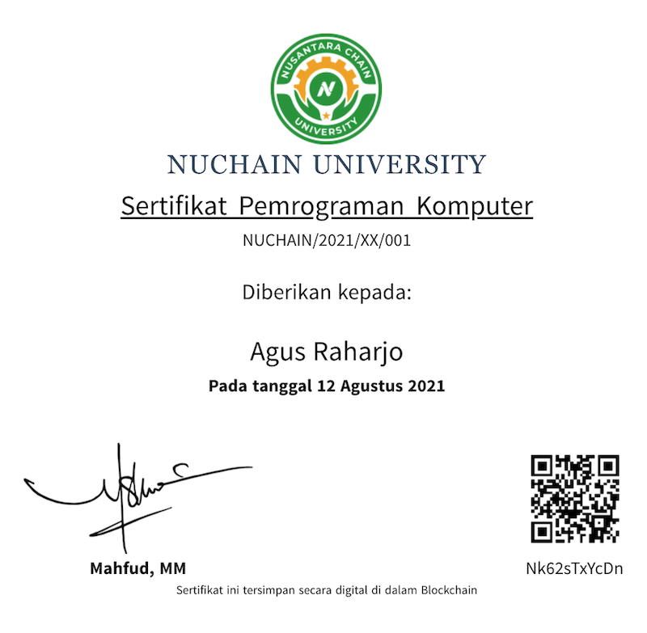

# Certificate Webapp

This is template to build webapp for certificate management that run on nuchain network.

Build using [Nuxt.js](https://nuxtjs.org/).

## Features

1. Create certificate
2. Issue certificate
3. View certificate
4. Generate printable PDF
5. Configurable view and PDF print layout.

## Customization

* App configuration can be found in `.env-example` file.
* Busines logic configuration can be found in `app.config.js` file, please edit accordingly.
* To replace logo please replace organization/company logo file in `/assets` with your prefered logo.

## Build Setup

1. Copy file `.env-example` to `.env`.
2. Edit the file `.env` according to your needs.
3. Run the following commands:

```bash
# initiate your environment variable
$ source .env

# install dependencies
$ yarn install

# serve with hot reload at localhost:3000
$ yarn dev
```

## Deployment

For deployment we only need the compiled static files, you can get compiled static files by typing:

```bash
$ yarn generate
```

## TTD

Please adjust `ttdmap.ts` for mapping signer name to hand writing human signature image,
signature images stored in `/assets/ttd`.


## Example

When running in development mode you can navigate the browser to: [http://localhost:3000/?i=Nk62sTxYcDn](http://localhost:3000/?i=Nk62sTxYcDn), and you can see single certificate page, you can customize it by editing `pages/index.vue` file.




